# Written Analysis: Election Audit with Python
> Analyzing the election results data set for a recent congressional election.

## Table of Contents
* [Overview of the project](#overview-of-the-project)
* [Purpose](#purpose)
* [Election Audit Results](#election-audit-results)
* [Election Audit Summary](#election-audit-summary)

## Overview of the project
This challenge is to perform analysis on the election result data using Visual Studio Code for the state of Colorado to determine votes and the corresponding winner and the county with the highest turnout.
### Purpose
The purpose of this challenge was to assist Tom, an employee of the Colorado board of election, to perform an election audit and present the analysis of a local congressional election

The analysis will allow Tom to get an overview of the total number of votes casted, total votes for each county and each candidate, the winning candidate and the county with the largest turnout. 

## Election Audit Results

I initialised a python script that reads the election data set, utilizes loop,conditional statements and perfoms calculations and finally write and print the output of the results to a text file and the terminal screen.

**1. Total votes cast in the congressional election** 
* A total of 369,711 votes were cast in this election, between the three participating counties. 
  Below are the images showing the codes and the output in the text file: 
  
**Code Used** 
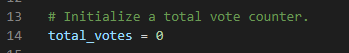

	
	
	


**Output in the text file** 
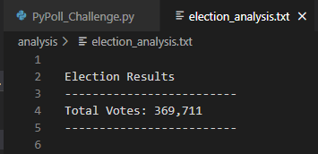

**2. Breakdown of the number of votes and the percentage of total votes for each county in the precinct.** 
* There were three participating counties in this election. 
  - Jefferson
  - Denver
  - Arapahoe

Of the total votes cast, 10.5% (38,855) were from Jefferson, 82.8% (306,055) were accounted from Denver and the remaining 6.7% (24,801) were from Arapahoe.

**Code Used** 


	
	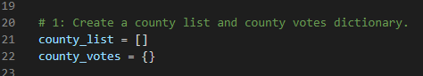
	
	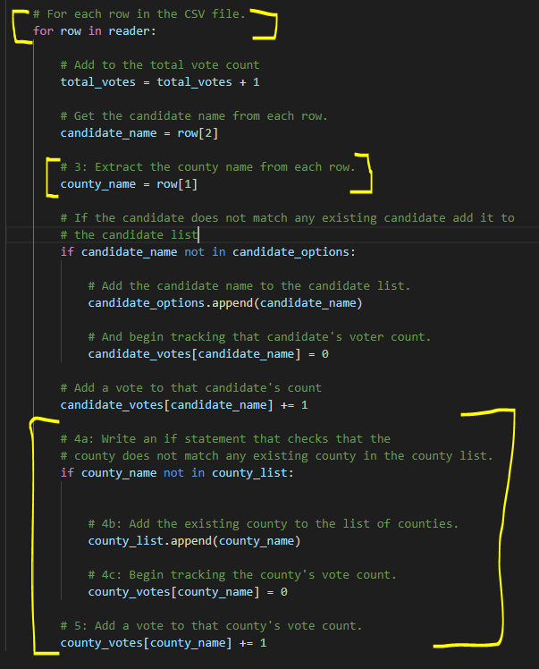
	
	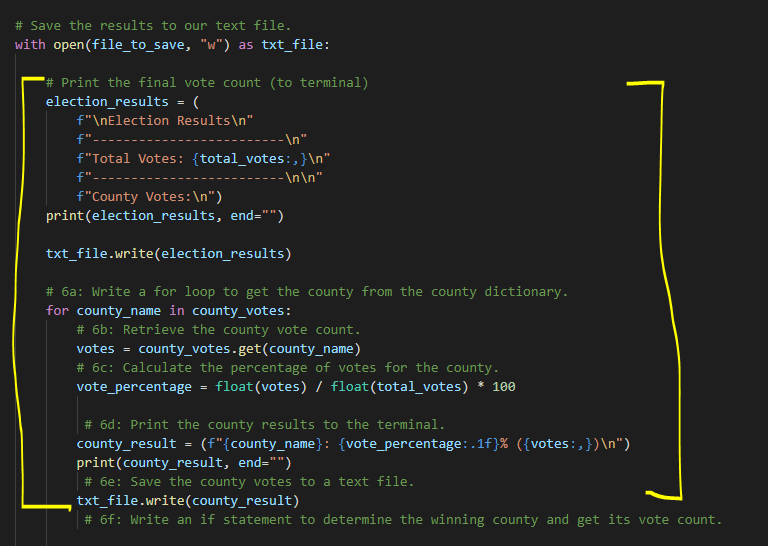


**Output in the text file** 

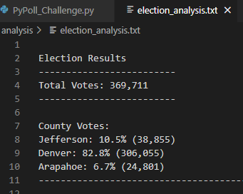

**3. The county with the largest number of votes.** 
* From the results shown above, it can be clearly determined that the highest voter turnout was from Denver accounting for 82.8% of the total votes cast.
  Below is the code used to run the output and the result as displayed in the text file:


	
	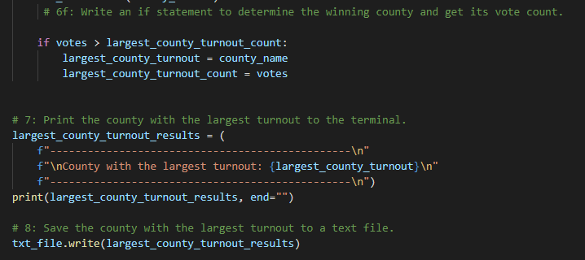
	
	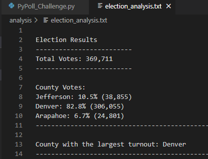
	


**4. Breakdown of the number of votes and the percentage of the total votes each candidate received.** 
* There were three participating candidates in this election. 
  - Charles Casper Stockham
  - Diana DeGette
  - Raymon Anthony Doane

Based on he data set and the analysis, below are the results for each candidate: 
  - Charles Casper Stockham received a total of 85,213 votes, accounting for 23% of the total votes.
  - Diana DeGette received a total of 272,892 votes which account for 73.8% of the total votes cast.
  - Raymon Anthony Doane received 11,606 votes, accounting for only 3.1% of the total votes.

**Code Used** 


	
	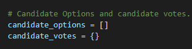
	
	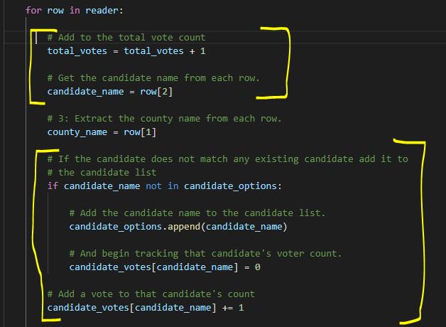
	
	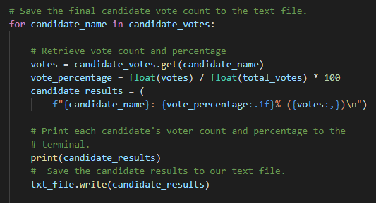


**Output in the text file** 

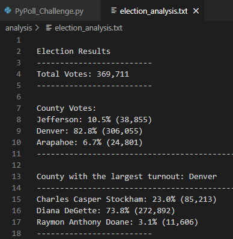

**5. The winning candidate, their vote count and the percentage of the total votes he/she received .** 
* Based on the analysis so  far, it can be clearly determined that the winner of this congressional election is Diana DeGette, with a whooping 272,892 votes that accounts for 73.8% of the total votes cast in the election.

The image below displays the code scripted and the output printed in the text file and in the terminal:

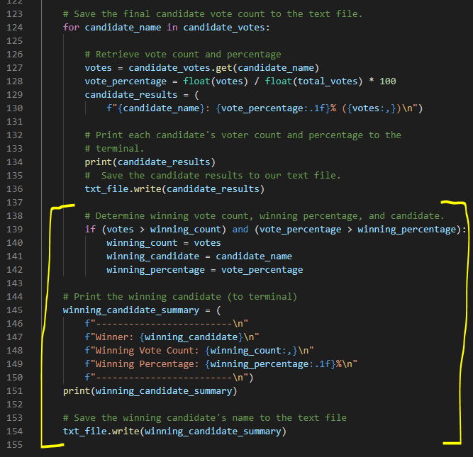

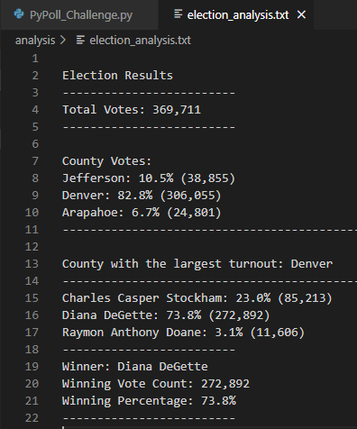

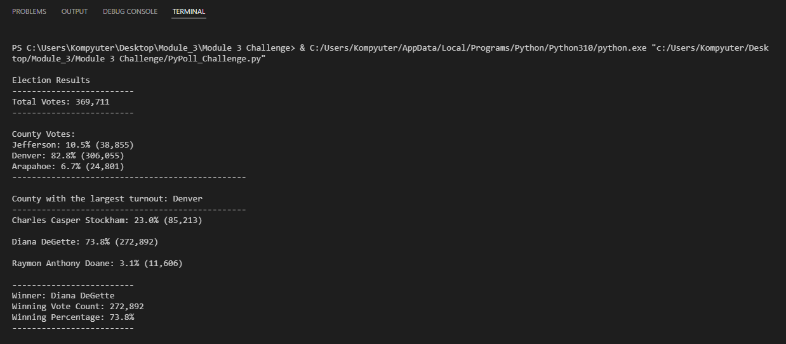

## Election Audit Summary

The python script is pretty versatile to be able to make modifications and add functionalities to make it work on bigger scale and with a variety of additional dataset and output values. With variations, the election commission can utilise this script to further develop and analyse results. 
Some examples are: 
   - Determine the voter turnout by polling location. Data for the polling location would be required, but adding this can allow us to get logistics around the voter volume per location         and may reveal some key data points that can help prepare for planning of future elections.
   - This script can also be utilised for future federal elections, by changing the data set to reflect the states instead of the counties.
   - Another important aspect for any election analysis could be the demographics of the voters as well as the candidates themselves. Adding this information into the data set can provide      with a deeper insight on what ethnicity of people, age group, gender, income group and many other data points , is the election or candidate catering and appealing to.
 

